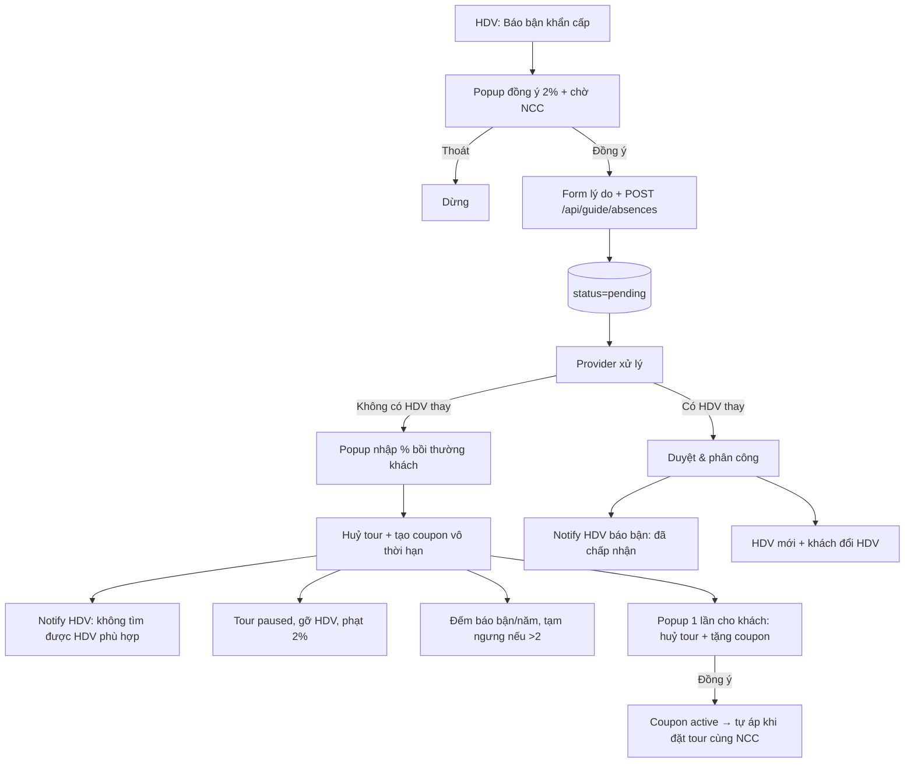

# Báo bận khẩn cấp (HDV) — Luồng nghiệp vụ & logic hệ thống

Tài liệu mô tả chức năng **Báo bận khẩn cấp**: HDV báo không thể dẫn → Provider tìm người thay hoặc huỷ tour. **Một mức duy nhất** (không chia theo số ngày). Bám code `TravelTour_Version2/TravelTour/`.

---

## 1. Mục đích

| Vai trò | Mục tiêu |
|---------|----------|
| **HDV** | Báo sự cố có minh chứng, không phải tự gỡ tour hay tự đổi lịch |
| **Provider** | Gán HDV thay **hoặc** huỷ tour (không có người thay) |
| **Khách** | Được thông báo khi đổi HDV hoặc tour bị huỷ |
| **Hệ thống** | Ghi audit (`guide_absence_requests`, `tour_guide_history`), ảnh hưởng hoa hồng HDV khi tour hoàn thành |

**Lưu ý:** Sau khi HDV gửi yêu cầu, tour **vẫn gán HDV cũ** cho đến khi Provider duyệt thay người, từ chối, hoặc huỷ tour. Gửi báo bận **không** tự gỡ HDV khỏi tour.

---

## 2. Sơ đồ luồng tổng quát



## Đền bù khách + coupon

- Provider bấm **Không có HDV thay — Huỷ tour** → popup nhập **% giảm giá**.
- Hệ thống tạo `customer_coupons` cho **từng khách có booking active** của tour (status `pending_claim`, vô thời hạn).
- Mỗi khách nhận **1 thông báo** (`type = tour_cancelled_with_coupon`) trong chuông.
- Khi khách mở trang → **popup hiện 1 lần** (theo `sessionStorage`), nội dung:
  > *"Tour của bạn đã được hủy bởi hệ thống vì một sự cố đột xuất. Chúng tôi chân thành xin lỗi bạn vì sự bất tiện này, chúng tôi sẽ hoàn lại đúng số tiền và gửi tặng bạn 1 mã giảm giá vô thời hạn áp dụng cho tất cả các tour của chúng tôi."*
- Bấm **Đồng ý** → `POST /api/customer/coupons/:id/claim` → coupon → `active` + đánh dấu đã đọc.
- Khi khách mở `thanhtoan.html` cho tour **bất kỳ thuộc cùng NCC** đó → `GET /api/customer/coupons/best/tour/:tourId` → **auto-apply** vào tổng tiền, gửi `coupon_id` lên `/api/bookings/confirm`. Sau khi đặt xong → coupon → `used`.

**Cơ sở 2% phạt HDV:** `SUM(bookings.final_price)` các booking đã `confirmed/paid/in_progress` (final_price là giá cuối sau giảm + thuế). Nếu chưa có booking thanh toán nào, fallback `tours.final_price × max_capacity`.

---

## 3. Bước 1 — HDV gửi yêu cầu

### 3.1 Giao diện

- Trang: `frontend/pages/guide/tourdangdan.html`
- Script: `frontend/assets/js/guide/tourdangdan.js`
- **Bước 1 — Popup đồng ý** (bắt buộc): nội dung cảnh báo đền bù **2%** nếu không có HDV thay; nút **Thoát** / **Đồng ý**.
- **Bước 2 — Form** (sau khi đồng ý): lý do + ảnh minh chứng.

### 3.2 Dữ liệu gửi

| Trường | Bắt buộc | Quy tắc |
|--------|----------|---------|
| `tour_id` | Có | Tour HDV đang được gán |
| `reason` | Có | ≥ 10 ký tự (trim) |
| `evidence` | Không | File upload multipart |

### 3.3 Upload minh chứng

- Middleware: `backend/middleware/uploadAbsenceEvidence.js`
- Thư mục: `uploads/absence-evidence/`
- Định dạng: JPG, PNG, WebP, GIF, PDF
- Dung lượng: **≤ 8 MB**
- URL lưu DB: `/uploads/absence-evidence/{filename}`

### 3.4 API

```
POST /api/guide/absences
Content-Type: multipart/form-data
```

**Ràng buộc khi tạo** (`guideAbsenceModel.createGuideAbsenceRequest`):

| # | Điều kiện | Lỗi |
|---|-----------|-----|
| 1 | `tours.guide_id` = HDV đang đăng nhập | "Bạn không phải HDV phụ trách tour này" |
| 2 | Tour **chưa** có `guide_completed_at` | "Tour đã hoàn thành, không thể gửi yêu cầu báo bận" |
| 3 | Chưa có yêu cầu `pending` khác cùng tour | "Đã có yêu cầu báo bận đang chờ xử lý cho tour này" |
| 4 | Lý do ≥ 10 ký tự | "Vui lòng mô tả lý do ít nhất 10 ký tự" |

**Sau khi tạo:** insert `guide_absence_requests` với `status = 'pending'`, `urgency` theo mục 4.

---

## 4. Mức độ khẩn (`urgency`)

Tính theo **khoảng cách từ thời điểm hiện tại đến `tours.start_date`** (ngày khởi hành tour).

Logic: `backend/utils/absenceUrgency.js` → `computeAbsenceUrgency(startDate)`

| Khoảng cách tới ngày khởi hành | Giá trị DB | Nhãn UI (Provider) |
|-------------------------------|------------|---------------------|
| ≤ **48 giờ** | `urgent` | **Khẩn cấp** |
| > 48 giờ và ≤ **7 ngày** (168 giờ) | `medium` | **Cần xử lý sớm** |
| > **7 ngày** | `low` | **Sắp tới** |

**Ví dụ:** Hôm nay 19/5, khởi hành 22/5 → còn ~3 ngày → `medium` (**Cần xử lý sớm**), không phải Khẩn cấp.

### 4.1 Cập nhật khi Provider đổi ngày khởi hành

`urgency` **không cố định** suốt đời yêu cầu `pending`:

1. **Khi đọc API danh sách/chi tiết:** với `status = pending`, hệ thống **tính lại** từ `tours.start_date` hiện tại (`mapRow` trong `guideAbsenceModel.js`).
2. **Khi Provider `PUT` cập nhật tour** có `start_date`: gọi `refreshPendingAbsenceUrgencyForTour(tourId)` để đồng bộ cột `urgency` trong DB (chuông thông báo, báo cáo).

**Sắp xếp danh sách Provider:** ưu tiên `pending` trước, sau đó theo mức khẩn (urgent → medium → low), rồi `start_date` gần nhất.

### 4.2 Ý nghĩa nghiệp vụ

`urgency` chỉ ảnh hưởng **nhãn, màu badge, thứ tự hiển thị, tone thông báo chuông**. **Không** thay đổi:

- Quyền duyệt / từ chối / huỷ tour  
- Ràng buộc chọn HDV thay  
- SLA tự động hay auto-huỷ tour  

---

## 5. Bước 2 — Provider nhận & xem

### 5.1 Giao diện

- Trang: `frontend/pages/provider/guide_absences.html`
- Script: `frontend/assets/js/provider/guide_absences.js`
- Badge sidebar: `frontend/assets/js/provider/provider-absence-badge.js`  
  API: `GET /api/provider/absence-requests/pending-count`

### 5.2 Thông báo

- Chuông Provider: query các yêu cầu `pending`, tiêu đề `HDV xin nghỉ - {Khẩn cấp | Cần xử lý sớm | Mới}`
- Link: `guide_absences.html`
- Tone: đỏ nếu `urgent`, cam nếu `medium` / `low`

### 5.3 API danh sách

```
GET /api/provider/absence-requests?status=pending|approved|rejected|all
```

Danh sách HDV thay thế cho tour:

```
GET /api/provider/tours/:tourId/replacement-candidates
```

---

## 6. Bước 3 — Provider xử lý (chỉ khi `status = pending`)

Mỗi yêu cầu chỉ xử lý **một lần**. Đã `approved` / `rejected` → lỗi *"Yêu cầu này đã được xử lý trước đó"*.

### 6.1 Duyệt & phân công HDV thay

```
POST /api/provider/absence-requests/:id/approve
Body: { replacement_guide_id, note? }
```

**Luồng:**

1. Validate `replacement_guide_id` bắt buộc, **khác** HDV đang báo bận.
2. Gọi `assignGuideToTour(providerId, tourId, replacementGuideId)`:
   - HDV thuộc cùng Provider  
   - `assertGuideTourScheduleNoConflict` — không trùng lịch tour khác  
   - `assertGuideHasFullAvailabilityForTour` — đủ ngày rảnh trên lịch availability  
3. `UPDATE guide_absence_requests` → `status = 'approved'`, `replacement_guide_id`, `resolved_at`, `provider_note`.
4. Thông báo **HDV mới** (`createGuideTourAssignedNotification`).
5. Thông báo **khách** booking tour: `tour_guide_changed`.
6. `tour_guide_history`: action `replaced` (khi có `previous_guide_id`).

### 6.2 Từ chối yêu cầu

```
POST /api/provider/absence-requests/:id/reject
Body: { note? }
```

| Hệ quả | Chi tiết |
|--------|----------|
| Yêu cầu | `status = 'rejected'` |
| Tour | **Giữ nguyên** `tours.guide_id` (HDV cũ) |
| Booking / khách | Không đổi |

HDV vẫn là người phụ trách theo hệ thống; xử lý tiếp theo là trách nhiệm HDV ↔ Provider ngoài luồng này.

### 6.3 Huỷ tour (không có HDV thay)

```
POST /api/provider/absence-requests/:id/cancel-tour
Body: { note? }
```

| Hệ quả | Chi tiết |
|--------|----------|
| Booking | `status = 'cancelled'` cho các booking: `pending`, `pending_payment`, `confirmed`, `paid`, `in_progress` |
| Lý do booking | `[Tour bị huỷ] {ghi chú provider}` |
| Tour | `status = 'paused'`, `guide_id = NULL` |
| Yêu cầu absence | `status = 'approved'`, `replacement_guide_id = NULL` (đã xử lý xong, không có người thay) |
| Lịch sử | `tour_guide_history` action `unassigned` |
| Khách | Notify: tour huỷ, hoàn tiền theo chính sách (nội dung mẫu trong code) |

Booking đã `cancelled` / `refunded` / `completed` **không** bị cập nhật.

---

## 7. Trạng thái yêu cầu (`guide_absence_requests.status`)

| Status | Ý nghĩa |
|--------|---------|
| `pending` | Chờ Provider |
| `approved` | Đã duyệt **có** HDV thay **hoặc** đã chọn huỷ tour (không có thay) |
| `rejected` | Provider từ chối yêu cầu báo bận |
| `cancelled` | Có trong schema ENUM; luồng chính không dùng cho huỷ tour (huỷ tour dùng `approved` + `replacement_guide_id = NULL`) |

---

## 8. Bảng dữ liệu

### 8.1 `guide_absence_requests`

| Cột | Mô tả |
|-----|--------|
| `guide_id` | HDV gửi báo bận |
| `tour_id` | Tour liên quan |
| `provider_id` | NCC sở hữu tour |
| `reason` | Lý do (TEXT) |
| `evidence_url` | URL ảnh/PDF minh chứng |
| `urgency` | `low` \| `medium` \| `urgent` |
| `status` | `pending` \| `approved` \| `rejected` \| `cancelled` |
| `requested_at` | Thời điểm gửi |
| `resolved_at` | Thời điểm Provider xử lý |
| `resolved_by_user_id` | User Provider xử lý |
| `replacement_guide_id` | HDV thay (nếu duyệt có thay) |
| `provider_note` | Ghi chú Provider |

### 8.2 `tour_guide_history` (audit)

Mỗi lần gán / thay / gỡ HDV qua luồng absence hoặc `assignGuideToTour`:

- `tour_id`, `guide_id`, `previous_guide_id`, `action` (`assigned` \| `replaced` \| `unassigned`), `reason`, `by_user_id`

---

## 9. Liên kết hoa hồng & thu nhập HDV

Khi tour **hoàn thành** (HDV bấm hoàn thành / tiến độ 100%):

- Chỉ **HDV cuối** trên `tours.guide_id` được tạo `guide_earnings` (100% gross tour đó).
- **HDV cũ** (đã báo bận và bị thay): **0%** — không có dòng thu nhập tour đó.

Chi tiết: `thuvien/hoa-hong-va-thanh-toan.md` (mục absence).

---

## 10. API tổng hợp

| Method | Endpoint | Vai trò |
|--------|----------|---------|
| `POST` | `/api/guide/absences` | HDV gửi báo bận |
| `GET` | `/api/guide/absences` | HDV xem yêu cầu của mình |
| `GET` | `/api/provider/absence-requests` | Provider danh sách |
| `GET` | `/api/provider/absence-requests/pending-count` | Badge số pending |
| `GET` | `/api/provider/tours/:tourId/replacement-candidates` | HDV có thể thay |
| `POST` | `/api/provider/absence-requests/:id/approve` | Duyệt + thay HDV |
| `POST` | `/api/provider/absence-requests/:id/reject` | Từ chối |
| `POST` | `/api/provider/absence-requests/:id/cancel-tour` | Huỷ tour |

---

## 11. File code tham chiếu

| Thành phần | Đường dẫn |
|------------|-----------|
| Model nghiệp vụ | `backend/models/guideAbsenceModel.js` |
| Tính urgency | `backend/utils/absenceUrgency.js` |
| Controller | `backend/controllers/guideAbsenceController.js` |
| Upload evidence | `backend/middleware/uploadAbsenceEvidence.js` |
| Route HDV | `backend/routes/guide.js` |
| Route Provider | `backend/routes/provider.js` |
| Gán HDV / validate lịch | `backend/models/providerModel.js` (`assignGuideToTour`, …) |
| Đồng bộ urgency khi sửa tour | `backend/controllers/providerController.js` (`updateTourController`) |
| Schema | `backend/scripts/ensureAppSchema.mjs` |
| UI HDV | `frontend/pages/guide/tourdangdan.html`, `…/tourdangdan.js` |
| UI Provider | `frontend/pages/provider/guide_absences.html`, `…/guide_absences.js` |

---

## 12. Ràng buộc & nghiệp vụ (tóm tắt)

1. Một tour chỉ **một** yêu cầu `pending` tại một thời điểm.  
2. Tour đã hoàn thành (`guide_completed_at`) → không gửi báo bận.  
3. HDV thay: cùng Provider, khác HDV hiện tại, không trùng lịch, đủ ngày rảnh.  
4. Huỷ tour: chỉ booking trạng thái active (xem mục 6.3).  
5. `urgency` pending luôn phản ánh **ngày khởi hành hiện tại** của tour.  
6. Gửi báo bận **không** tự gỡ HDV; Provider mới quyết định thay / giữ / huỷ.  
7. Audit: mọi thay đổi HDV ghi `tour_guide_history`.  
8. Hoa hồng tour: HDV cuối 100%, HDV cũ 0%.

---

## 13. Việc chưa có trong code (mở rộng tương lai)

- SLA / deadline bắt buộc xử lý theo `urgency`  
- Auto-huỷ tour nếu Provider không phản hồi  
- HDV tự huỷ yêu cầu `pending`  
- Hoàn tiền tự động khi `cancel-tour` (giai đoạn 3 escrow)  

---

*Tài liệu cập nhật theo code TravelTour. Liên quan: `thuvien/hoa-hong-va-thanh-toan.md`.*
